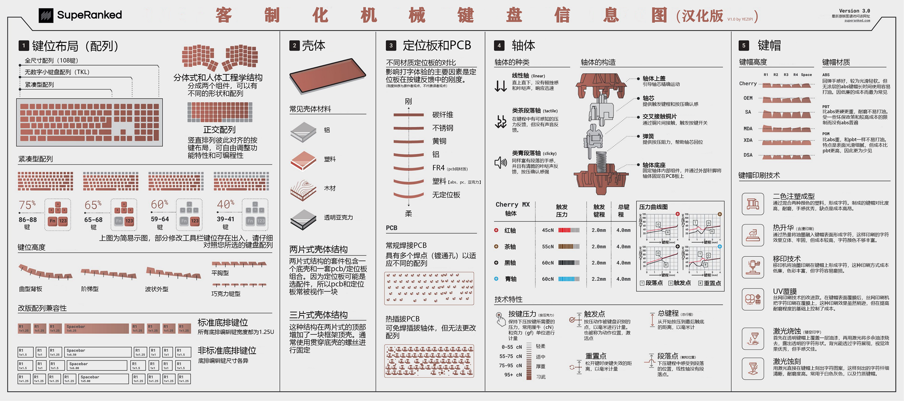

# Manual_Keyboard

Keyboar Layout Editor + Plate & Case Builder + PCB + kbfirmware

## Keyboard Layout

### 40%配列

- [Keyboar Layout Editor](http://www.keyboard-layout-editor.com)

## Keyboard Positioning Plate
[Plate & Case Builder](http://builder.swillkb.com/) 搭配 [Keyboar Layout Editor](http://www.keyboard-layout-editor.com) 使用

## Keyboard PCB
参考
- [标准poker配列](https://oshwhub.com/lleaves/mypoker_bak)
- [标准GH60](https://oshwhub.com/XIN_sk/biao-zhun-GH60ji-xie-jian-pan-14)

## Keyboard Firmware
[我的布局配置](./firmware/bbbond.json)

- [QMK](https://kbfirmware.com/)
- [QMK_FIRMWARE_GITHUB](https://github.com/qmk/qmk_firmware)

## Other

